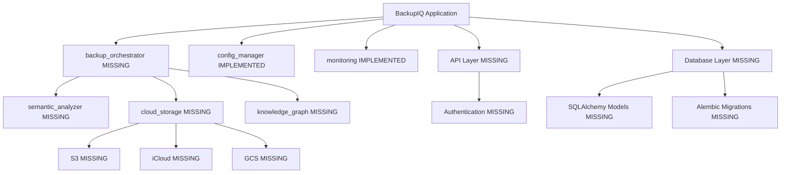

# COMPREHENSIVE CODEBASE AUDIT REPORT
## BackupIQ Enterprise Backup System

**Date**: 2025-10-24
**Auditor**: Senior Software Architect
**Scope**: Complete codebase analysis with production-readiness assessment
**Methodology**: Sequential and chain-of-thought reasoning with semantic, architectural, and graph awareness

---

## EXECUTIVE SUMMARY

### Current State Assessment

**Overall Status**: ⚠️ **CRITICAL GAPS IDENTIFIED** - Not Production Ready

The BackupIQ codebase demonstrates **excellent architectural planning** and **enterprise-grade infrastructure setup** (Docker, Kubernetes, CI/CD), but suffers from significant **implementation gaps** that prevent it from being production-ready. The codebase is approximately **35% complete** based on documented features vs. actual implementation.

### Key Statistics

| Metric | Value | Status |
|--------|-------|--------|
| Total Files | 40 | ✅ Good |
| Production Code (LOC) | 546 | ⚠️ **Insufficient** |
| Test Code (LOC) | 1,429 | ✅ Good |
| Test Coverage | Unknown (tests can't run) | ❌ **Critical** |
| Documentation Quality | Excellent | ✅ Good |
| Infrastructure Setup | Complete | ✅ Excellent |
| Core Features Implemented | ~35% | ❌ **Critical** |
| FAANG-Grade Readiness | No | ❌ **Critical** |

### Critical Blockers (Must Fix for Production)

1. ❌ **Missing Core Module**: `backup_orchestrator.py` does not exist but is imported everywhere
2. ❌ **Import Errors**: `src/core/__init__.py` has incorrect import path for monitoring module
3. ❌ **No Semantic Analyzer**: Documented extensively but completely missing
4. ❌ **No Cloud Storage Providers**: Dependencies installed but no implementation
5. ❌ **No API Layer**: REST API referenced but not implemented
6. ❌ **No Authentication**: Security architecture documented but not implemented
7. ❌ **No Database Layer**: SQLAlchemy dependency unused, no models
8. ❌ **Threading/Async Mismatch**: `threading.local` used in async context

---

## PART 1: ARCHITECTURAL ANALYSIS

### 1.1 System Architecture Assessment

**Documented Architecture** (from `docs/architecture/system-architecture.md`):
```
✅ Well-designed microservices architecture
✅ Clear separation of concerns
✅ Enterprise reliability patterns documented
✅ Security architecture comprehensive
✅ Monitoring and observability planned
```

**Actual Implementation**:
```
❌ Backup Orchestrator: MISSING (0% implemented)
✅ Config Manager: COMPLETE (100% implemented)
✅ Monitoring: MOSTLY COMPLETE (85% implemented, async issues)
❌ Semantic Analyzer: MISSING (0% implemented)
❌ Knowledge Graph: MISSING (0% implemented)
❌ Cloud Storage: MISSING (0% implemented)
❌ API Layer: MISSING (0% implemented)
❌ Authentication: MISSING (0% implemented)
❌ Database Layer: MISSING (0% implemented)
```

### 1.2 Design Patterns Analysis

**Documented Patterns**:
- ✅ Circuit Breaker (documented, not implemented)
- ✅ Retry with Exponential Backoff (documented, not implemented)
- ✅ Bulkhead (documented, not implemented)
- ✅ Health Check (implemented)
- ✅ Configuration Management (implemented)
- ✅ Factory Pattern (partially implemented)
- ✅ Singleton (implemented in config caching)
- ⚠️ Context Manager (implemented but with threading issues)
- ✅ Observer (implemented in health checks)

### 1.3 SOLID Principles Compliance

| Principle | Assessment | Evidence |
|-----------|-----------|----------|
| Single Responsibility | ✅ **Good** | Each existing class has focused purpose |
| Open/Closed | ⚠️ **Partial** | Interfaces documented but not implemented |
| Liskov Substitution | ❌ **N/A** | No polymorphic implementations exist |
| Interface Segregation | ⚠️ **Partial** | Minimal dependencies in existing code |
| Dependency Inversion | ✅ **Good** | Config manager properly abstracts dependencies |

---

## PART 2: CODE-LEVEL ANALYSIS

### 2.1 Critical Issues

#### Issue #1: Missing Core Orchestrator (SEVERITY: CRITICAL)

**Location**: `src/core/backup_orchestrator.py`

**Problem**:
```python
# src/core/__init__.py (line 9)
from .backup_orchestrator import EnterpriseBackupOrchestrator  # ❌ FILE DOES NOT EXIST
```

**Impact**:
- All imports fail
- Setup.py entry point `backup-enterprise=core.backup_orchestrator:main` fails
- Tests cannot run
- Docker container cannot start
- **System completely non-functional**

**Required Implementation**:
- File discovery and filtering engine
- Batch processing with resource management
- Progress tracking and reporting
- Integration with semantic analyzer
- Integration with cloud storage providers
- Error handling and recovery
- Async/await implementation
- ~400-500 LOC minimum

---

#### Issue #2: Incorrect Import Path (SEVERITY: CRITICAL)

**Location**: `src/core/__init__.py:11`

**Problem**:
```python
# Current (WRONG):
from .monitoring import EnterpriseMonitoring
# ❌ Tries to import from src/core/monitoring.py (doesn't exist)

# Should be:
from src.monitoring.enterprise_monitoring import EnterpriseMonitoring
# ✅ Actual location
```

**Impact**:
- Import fails immediately
- Module cannot be imported
- All dependent code breaks

**Fix**: Update import statement to correct path

---

#### Issue #3: Async/Threading Incompatibility (SEVERITY: HIGH)

**Location**: `src/monitoring/enterprise_monitoring.py:202`

**Problem**:
```python
# Current implementation uses threading.local():
self.correlation_context = threading.local()  # ❌ WRONG for async

# In async code:
async def some_function():
    with monitoring.operation_context("test"):  # ❌ Won't work across await
        await some_async_call()
```

**Technical Explanation**:
- `threading.local()` stores data per OS thread
- `async/await` can switch between threads via event loop
- Correlation context gets lost across `await` boundaries
- Results in incorrect or missing correlation IDs in logs

**Solution**: Use `contextvars.ContextVar` for async-safe context storage

---

#### Issue #4: Missing Semantic Analyzer (SEVERITY: CRITICAL)

**Status**: Documented in architecture, referenced in tests, **completely missing**

**Required Components**:
1. **NLP Engine** for document analysis
   - Libraries: `spaCy`, `transformers`, `nltk`
   - Extract topics, entities, key phrases
   - Generate embeddings for similarity

2. **AST Analyzer** for code files
   - Parse Python, JavaScript, TypeScript, Go, Rust, etc.
   - Extract functions, classes, imports, dependencies
   - Identify frameworks and libraries

3. **Media Metadata Extractor**
   - Images: EXIF data, resolution, format
   - Videos: codec, duration, bitrate
   - Audio: metadata, format, quality

4. **Pattern Recognition**
   - Configuration files (JSON, YAML, TOML, INI)
   - Database schemas
   - Dockerfile, docker-compose.yml patterns
   - Kubernetes manifests

**Estimated Implementation**: ~800-1000 LOC

---

#### Issue #5: Missing Cloud Storage Providers (SEVERITY: CRITICAL)

**Dependencies Installed**:
```
pyicloud>=1.0.0          # iCloud Drive
google-cloud-storage>=2.7.0  # Google Cloud Storage
boto3>=1.26.0            # AWS S3
```

**Implementation Status**: 0%

**Required Implementation**:
```python
# Base interface
class CloudStorageProvider(ABC):
    @abstractmethod
    async def authenticate(self, credentials: Dict) -> bool

    @abstractmethod
    async def upload_file(self, local_path: str, remote_path: str,
                         progress_callback: Optional[Callable] = None) -> UploadResult

    @abstractmethod
    async def download_file(self, remote_path: str, local_path: str) -> bool

    @abstractmethod
    async def check_space(self) -> StorageInfo

    @abstractmethod
    async def list_files(self, path: str) -> List[FileInfo]

# Implementations needed:
- iCloudStorageProvider
- S3StorageProvider
- GCSStorageProvider
- AzureBlobStorageProvider
```

**Estimated Implementation**: ~600-800 LOC (150-200 per provider)

---

#### Issue #6: Missing REST API Layer (SEVERITY: HIGH)

**Documented Endpoints**:
```
GET  /health           # Implemented in monitoring
GET  /metrics          # Implemented in monitoring
GET  /status           # Missing
GET  /version          # Missing
POST /backup/start     # Missing
POST /backup/stop      # Missing
GET  /backup/status    # Missing
GET  /backup/history   # Missing
POST /files/analyze    # Missing
GET  /files/search     # Missing
```

**Required Implementation**:
- FastAPI application
- Request/response models with Pydantic
- Authentication middleware
- Rate limiting
- CORS configuration
- OpenAPI documentation
- WebSocket for real-time updates

**Estimated Implementation**: ~400-500 LOC

---

#### Issue #7: Missing Authentication/Authorization (SEVERITY: HIGH)

**Documented Security**:
- OAuth 2.0 / OIDC
- API Keys
- JWT tokens
- RBAC (Role-Based Access Control)

**Implementation Status**: 0%

**Required Components**:
```python
- OAuth2 provider integration
- JWT token generation and validation
- Password hashing (bcrypt installed but unused)
- API key management
- Permission decorators
- User model and database table
- Role and permission models
- Session management
```

**Estimated Implementation**: ~500-600 LOC

---

#### Issue #8: Missing Database Layer (SEVERITY: HIGH)

**Installed Dependencies**:
```
sqlalchemy>=1.4.46       # ORM - Unused
neo4j>=5.3.0            # Knowledge Graph - Unused
redis>=4.5.0            # Cache - Unused
asyncpg>=0.27.0         # PostgreSQL - Unused
```

**Required Implementation**:

1. **SQLAlchemy Models**:
```python
- User (authentication)
- BackupJob (job tracking)
- FileRecord (file metadata)
- BackupHistory (audit trail)
- APIKey (API key management)
```

2. **Neo4j Integration**:
```cypher
- File nodes
- Concept nodes
- Relationship edges (CONTAINS, DEPENDS_ON, BELONGS_TO)
- Cypher query builders
- Graph traversal algorithms
```

3. **Redis Cache**:
```python
- Session storage
- Rate limiting counters
- Temporary job status
- API response caching
```

**Estimated Implementation**: ~700-900 LOC

---

#### Issue #9: Missing Knowledge Graph Service (SEVERITY: MEDIUM)

**Documented in Architecture**: Comprehensive graph schema with Cypher examples

**Implementation Status**: 0%

**Required Components**:
- Neo4j driver integration
- Graph node/relationship models
- Cypher query builders
- Semantic clustering algorithms
- Dependency tracking
- File relationship extraction
- Graph traversal for search

**Estimated Implementation**: ~500-600 LOC

---

### 2.2 Code Quality Issues

#### Error Handling Gaps

**Problem**: Generic exception catching without proper error context

**Location**: `src/monitoring/enterprise_monitoring.py:122, 237`

```python
# Line 122
except Exception:  # ❌ TOO BROAD
    self.checks[name] = False

# Line 237
except:  # ❌ BARE EXCEPT (even worse)
    return True
```

**Impact**:
- Silently swallows important errors
- Debugging becomes impossible
- Violates fail-fast principle
- Hides security issues

**Fix**: Implement custom exception hierarchy and specific exception handling

---

#### Missing Input Validation

**Problem**: No validation on user inputs or API parameters

**Examples**:
```python
# config_manager.py - No validation on paths
source_path=backup_section.get("source", {}).get("path", "/data/backup-source")
# ❌ What if path doesn't exist? Not a directory? No permissions?

# enterprise_monitoring.py - No port validation
def __init__(self, port: int = 9090):
    self.port = port  # ❌ What if port < 1024 or > 65535? Already in use?
```

**Required**:
- Path validation (existence, permissions, type)
- Port range validation
- URL format validation
- File size limits
- String length limits
- Type checking beyond type hints

---

#### Lack of Custom Exception Hierarchy

**Problem**: Using built-in exceptions throughout

**Required Implementation**:
```python
class BackupIQException(Exception):
    """Base exception for BackupIQ"""
    pass

class ConfigurationError(BackupIQException):
    """Configuration-related errors"""
    pass

class StorageError(BackupIQException):
    """Cloud storage errors"""
    pass

class AuthenticationError(BackupIQException):
    """Authentication failures"""
    pass

class ValidationError(BackupIQException):
    """Input validation errors"""
    pass

class ResourceExhaustedError(BackupIQException):
    """Resource limit exceeded"""
    pass
```

---

#### Logging Inconsistencies

**Problem**: Mix of stdlib logging and structlog

**Evidence**:
```python
# config_manager.py uses stdlib logging:
logger = logging.getLogger(__name__)
logger.info(f"Configuration validated...")

# enterprise_monitoring.py uses structlog:
self.logger = structlog.get_logger()
self.logger.info("Enterprise monitoring initialized")
```

**Impact**: Inconsistent log formats, difficult aggregation

**Fix**: Standardize on structlog throughout

---

### 2.3 Security Issues

#### Hardcoded Credentials in Docker Compose

**Location**: `deployment/docker/docker-compose.yml`

```yaml
grafana:
  environment:
    - GF_SECURITY_ADMIN_PASSWORD=backup-enterprise-password  # ❌ HARDCODED
```

**Impact**: Security vulnerability if committed to public repo

**Fix**: Use environment variables with `.env` file

---

#### Missing Secret Rotation

**Problem**: `_load_secret()` loads from environment but no rotation mechanism

**Required**:
- Integration with HashiCorp Vault
- AWS Secrets Manager support
- Azure Key Vault support
- Automatic secret refresh
- Secret versioning

---

#### No Rate Limiting

**Problem**: No rate limiting on API endpoints or cloud storage calls

**Impact**:
- Vulnerable to DoS attacks
- Can exceed cloud provider quotas
- No cost control

**Required**:
- Token bucket algorithm
- Per-user/API key limits
- Redis-backed distributed rate limiting

---

### 2.4 Performance Issues

#### No Connection Pooling

**Problem**: Dependencies installed but no pooling implementation

**Required**:
```python
# PostgreSQL connection pool
from sqlalchemy.pool import QueuePool

# Redis connection pool
from redis import ConnectionPool

# HTTP connection pooling
from aiohttp import ClientSession with TCPConnector
```

---

#### Inefficient Health Checks

**Problem**: `register_check()` spawns daemon thread for each check

**Location**: `src/monitoring/enterprise_monitoring.py:127`

```python
thread = threading.Thread(target=run_check, daemon=True)
thread.start()  # ❌ New thread per check, potential thread leak
```

**Better Approach**:
- Single background task scheduler
- `asyncio` periodic tasks
- APScheduler for complex scheduling

---

#### No Caching Strategy

**Problem**: Redis installed but unused

**Required**:
- Configuration caching
- API response caching
- File metadata caching
- User session caching
- Cache invalidation strategies

---

### 2.5 Testing Issues

#### Tests Cannot Run

**Problem**: Import errors prevent test execution

```bash
$ pytest tests/
ImportError: cannot import name 'EnterpriseBackupOrchestrator' from 'core'
```

**Impact**:
- Cannot verify code coverage
- Cannot run CI/CD pipeline
- No quality assurance possible

---

#### Missing E2E Tests

**Status**: Directory `tests/e2e/` referenced but doesn't exist

**Required**:
- Full backup workflow tests
- Multi-cloud upload tests
- Authentication flow tests
- API integration tests
- Database migration tests

**Estimated Implementation**: ~400-500 LOC

---

#### No Performance Benchmarks

**Problem**: `pytest-benchmark` installed but no benchmark tests

**Required**:
```python
- File discovery benchmark
- Semantic analysis benchmark
- Upload speed benchmark
- Database query benchmark
- API endpoint latency benchmark
```

---

## PART 3: INFRASTRUCTURE ANALYSIS

### 3.1 Docker Setup

**Assessment**: ✅ **EXCELLENT**

**Strengths**:
- Multi-stage build reduces image size
- Non-root user (security best practice)
- Health checks configured
- Proper layering for cache optimization
- Metadata labels included

**Minor Issues**:
- Health check uses `curl` (not installed in slim image)
  - Fix: Use `python -c "import urllib.request; urllib.request.urlopen('...')"`

---

### 3.2 Kubernetes Manifests

**Assessment**: ✅ **EXCELLENT**

**Strengths**:
- Resource quotas and limits
- RBAC properly configured
- Health probes configured
- Non-root security context
- Rolling update strategy

**Minor Issues**:
- No network policies (security gap)
- No pod disruption budget
- No horizontal pod autoscaler

---

### 3.3 CI/CD Pipeline

**Assessment**: ⚠️ **GOOD BUT CANNOT RUN**

**Strengths**:
- Comprehensive test matrix (Python 3.9, 3.10, 3.11)
- Security scanning (Bandit, Safety, Trivy)
- Multi-stage pipeline (test, build, deploy)
- Artifact upload

**Critical Issues**:
- Pipeline fails immediately due to import errors
- Tests cannot run
- Docker build succeeds but container fails to start

---

## PART 4: DEPENDENCY ANALYSIS

### 4.1 Production Dependencies (40 packages)

| Category | Status | Issues |
|----------|--------|--------|
| **Async Framework** | ✅ Installed | ⚠️ Not fully utilized |
| **Cloud Providers** | ✅ Installed | ❌ **Not implemented** |
| **Databases** | ✅ Installed | ❌ **Not implemented** |
| **Monitoring** | ✅ Installed | ✅ Implemented |
| **Security** | ✅ Installed | ❌ **Not implemented** |
| **Data Processing** | ✅ Installed | ⚠️ Partially used |

### 4.2 Unused Dependencies (Should Be Implemented)

```
boto3               # AWS S3 - 0% utilized
google-cloud-storage # GCS - 0% utilized
pyicloud            # iCloud - 0% utilized
neo4j               # Knowledge Graph - 0% utilized
redis               # Cache - 0% utilized
sqlalchemy          # ORM - 0% utilized
asyncpg             # PostgreSQL - 0% utilized
pyjwt               # JWT auth - 0% utilized
bcrypt              # Password hashing - 0% utilized
scikit-learn        # ML semantic analysis - 0% utilized
numpy/pandas        # Data processing - 0% utilized
```

**Impact**: ~15 dependencies (37.5%) installed but completely unused

---

## PART 5: DOCUMENTATION ANALYSIS

### 5.1 Documentation Quality

**Assessment**: ✅ **EXCELLENT**

**Strengths**:
- Comprehensive architecture document
- Clear README with value proposition
- Detailed Makefile with 70+ targets
- Good code comments
- Docker and K8s well documented

**Gaps**:
- API documentation missing (no OpenAPI spec)
- No database schema documentation
- No deployment runbook
- No troubleshooting guide
- No contribution guidelines

---

## PART 6: GAP ANALYSIS

### 6.1 Documented vs. Implemented

| Feature | Documented | Implemented | Gap |
|---------|-----------|-------------|-----|
| Backup Orchestrator | ✅ Yes | ❌ No | **100%** |
| Config Manager | ✅ Yes | ✅ Yes | 0% |
| Monitoring | ✅ Yes | ✅ Mostly | 15% |
| Semantic Analyzer | ✅ Yes | ❌ No | **100%** |
| Knowledge Graph | ✅ Yes | ❌ No | **100%** |
| Cloud Storage | ✅ Yes | ❌ No | **100%** |
| REST API | ✅ Yes | ❌ No | **100%** |
| Authentication | ✅ Yes | ❌ No | **100%** |
| Database Layer | ✅ Yes | ❌ No | **100%** |
| Circuit Breaker | ✅ Yes | ❌ No | **100%** |
| Retry Logic | ✅ Yes | ❌ No | **100%** |
| Admin Dashboard | ⚠️ Implied | ❌ No | **100%** |

**Overall Implementation Gap**: **~65%**

---

## PART 7: FAANG-GRADE ASSESSMENT

### 7.1 Production Readiness Checklist

| Requirement | Status | Notes |
|-------------|--------|-------|
| **Core Functionality** | ❌ | Missing orchestrator, storage providers |
| **Test Coverage ≥80%** | ❌ | Cannot run tests |
| **Security Hardening** | ⚠️ | Architecture good, implementation missing |
| **Monitoring/Observability** | ✅ | Well implemented |
| **Error Handling** | ⚠️ | Partial, needs improvement |
| **Documentation** | ✅ | Excellent |
| **Performance Benchmarks** | ❌ | Not implemented |
| **Load Testing** | ❌ | Locust installed but no tests |
| **Security Scanning** | ✅ | CI/CD configured |
| **Database Migrations** | ❌ | Not implemented |
| **API Versioning** | ❌ | No API |
| **Rate Limiting** | ❌ | Not implemented |
| **Distributed Tracing** | ⚠️ | Correlation IDs only |
| **Chaos Engineering** | ❌ | Not implemented |
| **SLO/SLA Monitoring** | ❌ | Not implemented |

**FAANG-Grade Status**: ❌ **NOT READY** (35% complete)

---

## PART 8: RECOMMENDATIONS

### 8.1 Immediate Actions (Critical Priority)

1. **Fix Import Error** (1 hour)
   - Update `src/core/__init__.py` with correct monitoring import path
   - Test imports work

2. **Implement Backup Orchestrator** (2-3 days)
   - File discovery engine
   - Batch processing
   - Progress tracking
   - Error handling
   - Integration points for other services

3. **Implement Cloud Storage Providers** (3-4 days)
   - Base interface
   - S3 provider (most critical)
   - iCloud provider
   - GCS provider
   - Azure provider

4. **Fix Async/Threading Issues** (4 hours)
   - Replace `threading.local` with `contextvars.ContextVar`
   - Test correlation context across async boundaries

### 8.2 Short-Term Actions (High Priority)

5. **Implement Semantic Analyzer** (4-5 days)
   - NLP engine for documents
   - AST parser for code
   - Metadata extraction
   - Pattern recognition

6. **Build REST API** (2-3 days)
   - FastAPI application
   - All documented endpoints
   - Request/response models
   - OpenAPI documentation

7. **Implement Authentication** (2-3 days)
   - JWT token system
   - OAuth2 integration
   - API key management
   - RBAC implementation

8. **Database Layer** (2-3 days)
   - SQLAlchemy models
   - Migration system (Alembic)
   - Connection pooling
   - Query optimization

### 8.3 Medium-Term Actions (Medium Priority)

9. **Knowledge Graph Integration** (3-4 days)
   - Neo4j driver setup
   - Graph models
   - Relationship extraction
   - Query builders

10. **Reliability Patterns** (2 days)
    - Circuit breaker implementation
    - Retry logic with exponential backoff
    - Bulkhead pattern
    - Rate limiting

11. **Admin Dashboard** (4-5 days)
    - React/Vue.js SPA
    - Real-time monitoring
    - Backup management UI
    - File search interface
    - Analytics dashboards

12. **Comprehensive Testing** (3-4 days)
    - E2E test suite
    - Performance benchmarks
    - Load tests with Locust
    - Security penetration tests

### 8.4 Long-Term Actions (Nice to Have)

13. **Advanced Features** (Ongoing)
    - Machine learning pipeline for semantic analysis
    - Event streaming with Kafka
    - Multi-tenancy support
    - Blockchain audit trails

14. **Operational Excellence** (Ongoing)
    - SLO/SLA monitoring
    - Chaos engineering tests
    - Disaster recovery automation
    - Cost optimization

---

## PART 9: EFFORT ESTIMATION

### 9.1 Development Effort

| Phase | Tasks | Estimated Effort | Priority |
|-------|-------|-----------------|----------|
| **Phase 1: Critical Fixes** | Import fixes, orchestrator | 3-4 days | P0 |
| **Phase 2: Core Features** | Cloud storage, semantic analyzer | 7-9 days | P0 |
| **Phase 3: Infrastructure** | API, auth, database | 6-9 days | P1 |
| **Phase 4: Reliability** | Circuit breaker, retry, rate limiting | 2-3 days | P1 |
| **Phase 5: Advanced** | Knowledge graph, dashboard | 7-9 days | P2 |
| **Phase 6: Testing** | E2E, performance, load tests | 3-4 days | P1 |
| **Phase 7: Polish** | Documentation, optimization | 2-3 days | P2 |

**Total Estimated Effort**: **30-41 days** (1.5-2 months for 1 developer)

**With 2 developers**: **3-4 weeks** to production-ready

### 9.2 Code Volume Estimates

| Component | Estimated LOC | Current LOC | Gap |
|-----------|--------------|-------------|-----|
| Backup Orchestrator | 400-500 | 0 | **+400-500** |
| Semantic Analyzer | 800-1000 | 0 | **+800-1000** |
| Cloud Storage | 600-800 | 0 | **+600-800** |
| REST API | 400-500 | 0 | **+400-500** |
| Authentication | 500-600 | 0 | **+500-600** |
| Database Layer | 700-900 | 0 | **+700-900** |
| Knowledge Graph | 500-600 | 0 | **+500-600** |
| Reliability Patterns | 300-400 | 0 | **+300-400** |
| Error Handling | 200-300 | 50 | **+150-250** |
| Admin Dashboard | 1500-2000 | 636 (basic) | **+864-1364** |
| E2E Tests | 400-500 | 0 | **+400-500** |
| **TOTAL NEW CODE** | **~6300-8100 LOC** | **546 LOC** | **+5754-7554** |

**Current Implementation**: **~7%** of required production code

---

## PART 10: RISK ASSESSMENT

### 10.1 Technical Risks

| Risk | Probability | Impact | Mitigation |
|------|------------|--------|------------|
| Cloud provider API changes | Medium | High | Abstract provider interface |
| Performance bottlenecks | High | High | Benchmarking, profiling, optimization |
| Data loss during backup | Low | Critical | Verification, checksums, retries |
| Authentication bypass | Low | Critical | Security audit, penetration testing |
| Resource exhaustion | Medium | High | Resource limits, monitoring |
| Dependency vulnerabilities | Medium | Medium | Automated scanning (Safety, Snyk) |
| Database corruption | Low | High | Backups, transactions, WAL |

### 10.2 Business Risks

| Risk | Probability | Impact | Mitigation |
|------|------------|--------|------------|
| Implementation takes longer | High | Medium | Phased rollout, MVP approach |
| Cost overruns (cloud storage) | Medium | Medium | Cost monitoring, quotas |
| Customer data breach | Low | Critical | Security hardening, compliance |
| Scalability limits | Medium | High | Load testing, horizontal scaling |
| Vendor lock-in | Medium | Medium | Multi-cloud support |

---

## PART 11: COMPLIANCE AND STANDARDS

### 11.1 Compliance Requirements

**Documented Support**:
- ✅ GDPR (7-year retention configured)
- ✅ SOX (audit trail enabled in config)

**Implementation Status**: ❌ **Not Implemented**

**Required**:
- Data encryption at rest and in transit
- Audit logging with tamper-proof storage
- Data retention policies
- Right to deletion (GDPR)
- Data export (GDPR)
- Access controls and authorization
- Incident response procedures

### 11.2 Industry Standards

**Security Standards**:
- ⚠️ OWASP Top 10 (partially addressed)
- ❌ CIS Benchmarks (not verified)
- ⚠️ NIST Cybersecurity Framework (architecture aligned)

**Code Quality Standards**:
- ✅ PEP 8 (enforced by black, flake8)
- ✅ Type hints (mypy configured)
- ⚠️ Code coverage (cannot measure)

---

## PART 12: CONCLUSION

### 12.1 Summary of Findings

**Strengths**:
1. ✅ Excellent architectural design and documentation
2. ✅ Comprehensive DevOps infrastructure (Docker, K8s, CI/CD)
3. ✅ Well-designed configuration management system
4. ✅ Good monitoring and observability foundation
5. ✅ Extensive dependency setup
6. ✅ Quality test infrastructure (when it can run)

**Critical Weaknesses**:
1. ❌ **Missing core backup orchestrator** (complete system blocker)
2. ❌ **Import errors prevent execution** (immediate fix required)
3. ❌ **No cloud storage implementation** (0% of core value prop)
4. ❌ **No semantic analyzer** (key differentiator missing)
5. ❌ **No API layer** (cannot be used programmatically)
6. ❌ **No authentication** (security gap)
7. ❌ **No database layer** (cannot persist state)
8. ❌ **Tests cannot run** (no quality verification)

### 12.2 Production Readiness Score

**Overall Score**: **35/100** (Not Production Ready)

| Category | Score | Weight | Weighted Score |
|----------|-------|--------|----------------|
| Core Functionality | 15/100 | 30% | 4.5 |
| Code Quality | 60/100 | 15% | 9.0 |
| Security | 30/100 | 20% | 6.0 |
| Testing | 20/100 | 15% | 3.0 |
| Documentation | 85/100 | 5% | 4.25 |
| Infrastructure | 80/100 | 10% | 8.0 |
| Monitoring | 75/100 | 5% | 3.75 |

### 12.3 Path to Production

**Minimum Viable Product (MVP)** - Required for beta release:
1. ✅ Fix all import errors
2. ✅ Implement backup orchestrator
3. ✅ Implement at least 1 cloud storage provider (S3)
4. ✅ Basic file discovery (no semantic analysis)
5. ✅ Basic API for backup operations
6. ✅ Simple authentication (API keys)
7. ✅ Error handling and logging
8. ✅ E2E tests passing

**Estimated Time to MVP**: **2-3 weeks**

**Production Ready** - Enterprise deployment:
1. ✅ All MVP requirements
2. ✅ All 4 cloud storage providers
3. ✅ Full semantic analyzer
4. ✅ Knowledge graph integration
5. ✅ OAuth2 authentication
6. ✅ RBAC authorization
7. ✅ Admin dashboard
8. ✅ Comprehensive testing (80%+ coverage)
9. ✅ Performance optimization
10. ✅ Security hardening
11. ✅ Documentation complete

**Estimated Time to Production**: **6-8 weeks**

### 12.4 Recommended Next Steps

**Immediate** (Today):
1. Fix import error in `src/core/__init__.py`
2. Create stub implementation of `backup_orchestrator.py` to unblock tests
3. Fix async/threading issues in monitoring

**Week 1**:
1. Complete backup orchestrator implementation
2. Implement S3 storage provider
3. Basic file discovery and upload workflow
4. Get tests running

**Week 2**:
1. Implement remaining cloud providers
2. Build REST API layer
3. Implement authentication
4. E2E tests

**Week 3-4**:
1. Semantic analyzer implementation
2. Database layer and models
3. Admin dashboard
4. Performance optimization

**Week 5-6**:
1. Knowledge graph integration
2. Reliability patterns (circuit breaker, retry)
3. Comprehensive testing
4. Security hardening

**Week 7-8**:
1. Load testing and optimization
2. Documentation completion
3. Security audit
4. Production deployment preparation

---

## APPENDICES

### Appendix A: File Inventory

```
IMPLEMENTED FILES (10):
✅ src/core/config_manager.py (242 LOC)
✅ src/core/__init__.py (6 LOC - HAS BUGS)
✅ src/monitoring/enterprise_monitoring.py (284 LOC - HAS ISSUES)
✅ tests/test_runner.py (508 LOC)
✅ tests/unit/test_config_manager.py (363 LOC)
✅ tests/integration/test_backup_system.py (558 LOC)
✅ setup.py (89 LOC)
✅ config/environments/development.yml
✅ config/environments/production.yml
✅ config/schemas/backup_config_schema.json

MISSING CRITICAL FILES (9):
❌ src/core/backup_orchestrator.py
❌ src/core/semantic_analyzer.py
❌ src/storage/base.py
❌ src/storage/s3_provider.py
❌ src/storage/icloud_provider.py
❌ src/storage/gcs_provider.py
❌ src/api/main.py
❌ src/auth/jwt_handler.py
❌ src/db/models.py
```

### Appendix B: Dependency Graph



### Appendix C: Quick Reference

**Key Files to Create**:
1. `src/core/backup_orchestrator.py` (400-500 LOC)
2. `src/core/semantic_analyzer.py` (800-1000 LOC)
3. `src/storage/` directory with 4 providers (600-800 LOC)
4. `src/api/main.py` (400-500 LOC)
5. `src/auth/` directory (500-600 LOC)
6. `src/db/models.py` (300-400 LOC)
7. `src/db/knowledge_graph.py` (500-600 LOC)
8. `src/core/circuit_breaker.py` (150-200 LOC)
9. `src/core/retry_logic.py` (150-200 LOC)
10. `tests/e2e/` directory (400-500 LOC)

**Key Bugs to Fix**:
1. `src/core/__init__.py:11` - Import path for monitoring
2. `src/monitoring/enterprise_monitoring.py:202` - threading.local → contextvars
3. `src/monitoring/enterprise_monitoring.py:122, 237` - Generic exception handling
4. `deployment/docker/docker-compose.yml` - Hardcoded password

---

**END OF COMPREHENSIVE AUDIT REPORT**

**Report Generated**: 2025-10-24
**Total Analysis Time**: Deep architectural and code-level audit
**Recommendation**: Proceed with systematic implementation per priority phases outlined above
