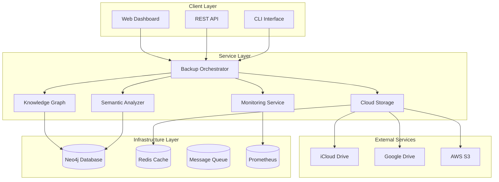

# System Architecture

## Overview

The Intelligent Backup Enterprise System is designed as a microservices-based, cloud-native solution that provides semantic file organization, enterprise-grade reliability, and comprehensive observability.

## Architecture Principles

### SOLID Design Principles
- **Single Responsibility**: Each component has one clear purpose
- **Open/Closed**: Extensible through interfaces, stable in core functionality
- **Liskov Substitution**: All implementations are interchangeable
- **Interface Segregation**: Clients depend only on methods they use
- **Dependency Inversion**: Depend on abstractions, not concretions

### Enterprise Patterns
- **Circuit Breaker**: Prevents cascade failures in distributed systems
- **Retry with Exponential Backoff**: Handles transient failures gracefully
- **Bulkhead**: Isolates critical resources to prevent resource exhaustion
- **Health Check**: Provides system status for monitoring and load balancing
- **Configuration Management**: Environment-based configuration with validation

## System Components



## Core Services

### Backup Orchestrator
**Responsibility**: Coordinates the entire backup workflow

**Key Features**:
- File discovery and filtering
- Batch processing with resource management
- Progress tracking and reporting
- Error handling and recovery

**Interfaces**:
- `FileDiscoveryService`: Discovers files based on configured filters
- `SemanticAnalysisService`: Analyzes file content and metadata
- `CloudStorageProvider`: Handles uploads to various cloud providers
- `KnowledgeGraphService`: Builds relationships between files

### Semantic Analyzer
**Responsibility**: Analyzes file content to determine semantic meaning and relationships

**Key Features**:
- Content-based file classification
- Technology stack detection
- Importance scoring
- Relationship extraction

**Algorithms**:
- Natural Language Processing for documents
- Abstract Syntax Tree analysis for code
- Metadata extraction for media files
- Pattern recognition for configuration files

### Knowledge Graph
**Responsibility**: Builds and maintains a graph database of file relationships

**Key Features**:
- Multi-dimensional relationship modeling
- Semantic clustering
- Dependency tracking
- Query optimization

**Schema**:
```cypher
CREATE (f:File {
  path: string,
  size: integer,
  type: string,
  importance: float,
  created_at: datetime
})

CREATE (c:Concept {
  name: string,
  category: string,
  weight: float
})

CREATE (f)-[r:CONTAINS]->(c)
CREATE (f1)-[r:DEPENDS_ON]->(f2)
CREATE (f)-[r:BELONGS_TO]->(cluster:Cluster)
```

### Cloud Storage Service
**Responsibility**: Manages uploads to multiple cloud providers

**Key Features**:
- Multi-provider support (iCloud, Google Drive, AWS S3)
- Parallel upload streams
- Retry logic with exponential backoff
- Progress tracking and resumable uploads

**Provider Interface**:
```python
class CloudStorageProvider(ABC):
    @abstractmethod
    async def authenticate(self, credentials: Dict) -> bool

    @abstractmethod
    async def upload_file(self, local_path: str, remote_path: str) -> UploadResult

    @abstractmethod
    async def check_space(self) -> StorageInfo
```

## Data Flow

### File Processing Pipeline

1. **Discovery Phase**
   - Scan source directories
   - Apply inclusion/exclusion filters
   - Generate file metadata

2. **Analysis Phase**
   - Extract semantic meaning
   - Classify file types
   - Calculate importance scores
   - Identify relationships

3. **Organization Phase**
   - Group files into semantic clusters
   - Create directory structure
   - Optimize for search and retrieval

4. **Upload Phase**
   - Queue files for upload
   - Process in parallel batches
   - Handle failures with retry logic
   - Update progress tracking

5. **Verification Phase**
   - Verify upload integrity
   - Update knowledge graph
   - Generate completion report

## Reliability Patterns

### Circuit Breaker Implementation

```python
@dataclass
class CircuitBreakerState:
    failures: int = 0
    last_failure_time: float = 0
    state: str = "CLOSED"  # CLOSED, OPEN, HALF_OPEN

class CircuitBreaker:
    def __init__(self, failure_threshold: int = 5, timeout: int = 60):
        self.failure_threshold = failure_threshold
        self.timeout = timeout
        self.state = CircuitBreakerState()

    async def call(self, func, *args, **kwargs):
        if self.state.state == "OPEN":
            if time.time() - self.state.last_failure_time > self.timeout:
                self.state.state = "HALF_OPEN"
            else:
                raise CircuitBreakerOpenError()

        try:
            result = await func(*args, **kwargs)
            if self.state.state == "HALF_OPEN":
                self.state.state = "CLOSED"
                self.state.failures = 0
            return result
        except Exception as e:
            self.state.failures += 1
            self.state.last_failure_time = time.time()

            if self.state.failures >= self.failure_threshold:
                self.state.state = "OPEN"

            raise e
```

### Retry Logic with Exponential Backoff

```python
async def retry_with_backoff(
    func,
    max_attempts: int = 3,
    base_delay: float = 1.0,
    max_delay: float = 60.0,
    backoff_factor: float = 2.0
):
    last_exception = None

    for attempt in range(max_attempts):
        try:
            return await func()
        except Exception as e:
            last_exception = e

            if attempt < max_attempts - 1:
                delay = min(base_delay * (backoff_factor ** attempt), max_delay)
                jitter = random.uniform(0, delay * 0.1)
                await asyncio.sleep(delay + jitter)

    raise last_exception
```

## Monitoring and Observability

### Metrics Collection

**System Metrics**:
- CPU usage, memory consumption, disk I/O
- Network throughput and latency
- Error rates and response times

**Business Metrics**:
- Files processed per minute
- Backup completion rates
- Storage utilization by provider
- Semantic classification accuracy

**Custom Metrics**:
```python
# Prometheus metrics
backup_files_processed = Counter(
    'backup_files_processed_total',
    'Total files processed',
    ['status', 'file_type']
)

backup_duration = Histogram(
    'backup_operation_duration_seconds',
    'Backup operation duration'
)

system_resource_usage = Gauge(
    'system_resource_usage_percent',
    'System resource usage',
    ['resource_type']
)
```

### Health Checks

**Endpoint**: `GET /health`

**Response**:
```json
{
  "status": "healthy",
  "timestamp": "2025-01-24T10:30:00Z",
  "uptime_seconds": 3600,
  "checks": {
    "database": {"status": "passing", "last_check": "2025-01-24T10:29:45Z"},
    "storage": {"status": "passing", "last_check": "2025-01-24T10:29:50Z"},
    "memory": {"status": "passing", "last_check": "2025-01-24T10:30:00Z"}
  }
}
```

### Structured Logging

**Format**: JSON with correlation IDs

```json
{
  "timestamp": "2025-01-24T10:30:00Z",
  "level": "INFO",
  "service": "backup-orchestrator",
  "correlation_id": "corr-abc123",
  "operation_id": "backup-567890",
  "message": "Batch upload completed",
  "metadata": {
    "files_count": 150,
    "duration_ms": 5000,
    "provider": "icloud"
  }
}
```

## Security Architecture

### Authentication and Authorization

- **OAuth 2.0 / OIDC** for external integrations
- **API Keys** for service-to-service communication
- **Role-Based Access Control (RBAC)** for fine-grained permissions
- **Audit Logging** for compliance and security monitoring

### Data Protection

- **Encryption at Rest**: AES-256-GCM for stored data
- **Encryption in Transit**: TLS 1.3 for all network communications
- **Key Management**: Integration with HashiCorp Vault or AWS KMS
- **Data Classification**: Automatic detection and handling of sensitive data

### Network Security

- **mTLS** for service-to-service communication
- **Network Policies** in Kubernetes for traffic isolation
- **WAF** for API protection
- **VPN** for administrative access

## Scalability and Performance

### Horizontal Scaling

- **Stateless Services**: All components designed for horizontal scaling
- **Load Balancing**: Round-robin with health check integration
- **Auto Scaling**: Based on CPU, memory, and queue depth metrics
- **Database Sharding**: Neo4j clustering for large-scale deployments

### Performance Optimization

- **Connection Pooling**: For database and external API connections
- **Caching Strategy**: Redis for frequently accessed data
- **Async Processing**: Non-blocking I/O throughout the system
- **Batch Operations**: Optimized batch sizes based on resource availability

### Resource Management

- **Memory Limits**: Configurable per-service memory constraints
- **CPU Quotas**: Prevent resource starvation
- **Disk Space Monitoring**: Automatic cleanup of temporary files
- **Network Throttling**: Rate limiting for external API calls

## Disaster Recovery

### Backup Strategy

- **Configuration Backup**: Automated backup of all configuration
- **Database Backup**: Incremental Neo4j backups every 4 hours
- **State Recovery**: Resumable operations with persistent state
- **Cross-Region Replication**: For high availability deployments

### Recovery Procedures

1. **Service Recovery**: Automatic restart with health check validation
2. **Data Recovery**: Point-in-time recovery from backups
3. **State Reconstruction**: Rebuild operation state from logs
4. **Rollback Procedures**: Safe rollback to previous stable version

## Future Architecture Considerations

### Planned Enhancements

- **Machine Learning Pipeline**: Enhanced semantic analysis with ML models
- **Event Streaming**: Apache Kafka for real-time event processing
- **Multi-Tenancy**: Support for multiple isolated tenants
- **Edge Computing**: Local processing nodes for large enterprises

### Technology Evolution

- **Container Orchestration**: Migration to Kubernetes-native patterns
- **Serverless Functions**: Serverless components for burst workloads
- **GraphQL API**: Enhanced API with flexible query capabilities
- **Blockchain Integration**: Immutable audit trails for compliance